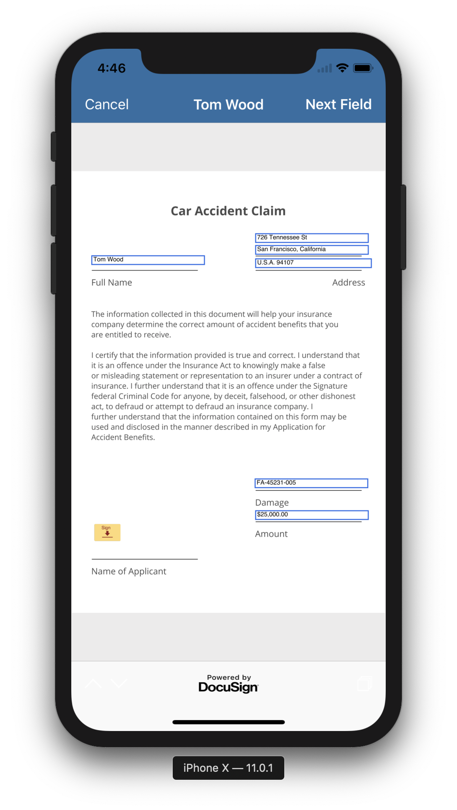
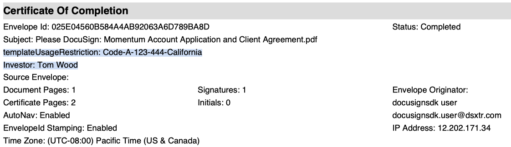

# DocuSign Native iOS SDK - Using Envelope Defaults

This guide explains how to use the Default Values for *Recipients*, *Tabs* and *Document Custom Fields* with a sample template. The swift sample code in sections below uses the values defined in the sample [template file](support-files/Home_insurance_claim_adjuster_template.json) and this can be uploaded to your account to get sample code to work with minimum modification. Do ensure that `templateId` matches the template uploaded in your sandbox.

[`DSMEnvelopeDefault`](https://developers.docusign.com/ios_sdk/refdocs/html/interface_d_s_m_envelope_defaults.html) allows customizing the envelope during sign and send flow with a template. 
- `recipientDefaults`: `Array<DSMRecipientDefault>` representing individual object for each of the recipient in the template.
- `tabValueDefaults`: `Dictionary<String, String>` containing the tab defaults data to apply for recipient tabs. Each key represents an existing `tabLabel` in template, SDK silently ignores the default value provided if no tab is found with a given `tabLabel` in the template.
- `customFields`: Document Custom Fields can override the default custom fields in the template or adds passed objects as new fields on envelope.
- `emailSubject`: Email subject to use when generating an envelope with a given template.
- `emailBlurb`: Email body to use when generating an envelope with a given template.
- `envelopeTitle`: Envelope title to use during signing ceremony.

## Sample Template

A good place to learn more about templates is [template creation guide](https://support.docusign.com/en/guides/ndse-user-guide-create-templates), here is a sample [template file](support-files/Home_insurance_claim_adjuster_template.json). Templates can be used to sign and send envelopes with ease in online or offline mode. Some important attributes to take note of are:
- Template Id: `"templateId": "606f0e95-a419-4280-86ac-234913037962"`
  - Note: `templateId` is regenerated when a template is uploaded successfully. Update the new `templateId` in the sample code below for it to work.
- Recipient Details, such as `recipientId`, `roleName` & `recipientType`. For extra information on these and other attributes refer the [API Guide](https://developers.docusign.com/esign-rest-api/guides/concepts/recipients):
    ```
    "recipients": {
      ...
      "inPersonSigners": [
        ...
        "recipientId": "18375691",
        "roleName": "claimant-roleName",
        "recipientType": "inpersonsigner",
      ]
    }
    ```
- Tab Details, such as `tabLabel`, `value` & `tabType`. For extra information on these and other attributes refer the [API Guide](https://developers.docusign.com/esign-rest-api/guides/concepts/tabs):
    ```
    "recipients": {
      ...
      "inPersonSigners": [
        ...
        "tabs": {
          ...
          "textTabs": [
            ...
            "tabLabel": "Text FullName",
            "tabId": "8823752a-4d40-4cab-b1a1-0119b21ff3fd",
            "value": "",
            "tabType": "text",
            ...
            "tabLabel": "Text Address Line 1",
            "tabId": "44089cd4-d99f-465d-b651-3765bda7f64c",
            "value": "",
            "tabType": "text",
            ...
          ]
        }
      ]
    }
    ```
- Document Custom Fields, for additional information refer [this page](https://support.docusign.com/en/guides/ndse-admin-guide-custom-fields): 
    ```
    "customFields": {
        "textCustomFields": [
            {
                "fieldId": "10264672785",
                "name": "templateUsageRestriction",
                "show": "false",
                "required": "false",
                "value": "allOptions"
            }
        ],
        "listCustomFields": []
    },
    ```

## Recipient Details Default Values

The key difference between creating envelopes and templates is that with templates you can add placeholder roles to your recipients list. SDK allows setting the values for recipient details (`email`, `name` & `type`) during sign or send ceremony kickoff. This is done via [`DSMRecipientDefault`](https://developers.docusign.com/ios_sdk/refdocs/html/interface_d_s_m_recipient_default.html). `recipientDefaults` property on [`DSMEnvelopeDefault`](https://developers.docusign.com/ios_sdk/refdocs/html/interface_d_s_m_envelope_defaults.html) contains an array of `DSMRecipientDefault` representing individual object for each of the recipient in the template. `DSMRecipientDefault` also allows switching a recipient type (say from an `.inPersonSigner` to `.signer`) and also delete a recipient using `removeRecipient` property. 

```
    // Identifier for the template to start the `send template` flow
    let templateId = "606f0e95-a419-4280-86ac-234913037962"

    let recipientDefault = DSMRecipientDefault()

    // Use recipient roleName to find unique recipient in the template
    recipientDefault.recipientRoleName = "claimant-roleName"
    recipientDefault.recipientSelectorType = .recipientRoleName
    recipientDefault.recipientType = .inPersonSigner
    
    // In-person-signer name
    recipientDefault.inPersonSignerName = "Tom Wood"

    // Host name and email
    // If self hosting on the device, host name and email must match to logged-in account
    recipientDefault.recipientName = "docusignsdk user"
    recipientDefault.recipientEmail = "docusignsdk.user@dsxtr.com"

    // Set `true` to remove a recipient
    recipientDefault.removeRecipient = false

    let envelopeDefaults = DSMEnvelopeDefaults()
    envelopeDefaults.recipientDefaults = recipientDefault 

    // Presenting controller for signing ceremony UI components
    let viewController = self 

    // Use the tabData to auto-fill (or set default tab values) during signing
    DSMTemplatesManager().presentSendTemplateControllerWithTemplate (
        withId: templateId,
        envelopeDefaults: envelopeDefaults,
        pdfToInsert: nil,
        insertAtPosition: .end,
        signingMode: .online,
        presenting: viewController, 
        animated: true) { (view, error) in
            if let error = error {
                NSLog("Error encountered during signing: \(error.localizedDescription)")
            }
            if view == nil {
                NSLog("Error encountered during signing: nil view")
            }
    }

    // Proceed to "Sign & Send Template with Default Values" section below
```

## Tab Default Values

Tab default values are set using the `tabLabel` attribute for text based tab(s) in a given template. These are also called [Data Labels](https://support.docusign.com/en/videos/Data-Labels). These `tabLabel` can be set for all tabs including [Custom Fields](https://support.docusign.com/guides/ndse-user-guide-custom-fields). `tabValueDefaults` property on [`DSMEnvelopeDefault`](https://developers.docusign.com/ios_sdk/refdocs/html/interface_d_s_m_envelope_defaults.html) contains a dictionary `Dictionary<String, String>` representing tab(s) with given `tabLabel` as key in the template. SDK allows setting tab values for one or more text-based tabs using the `tabLabel` fields, SDK silently ignores the default value provided if no tab is found with a given `tabLabel` in the template. Considering the [template above](#sample-template), let's explore how to set default value for `"Text FullName"` and `"Text Address Line 1"`. 

**Note:** A issue with sdk `v2.2` (and earlier versions) prevents tab defaults to be applied if `recipientDefaults` as `nil`. If a `nil` value is used for `recipientDefaults`, `tabValueDefaults` is ignored. 

```
    // Identifier for the template to start the `send template` flow
    let templateId = "606f0e95-a419-4280-86ac-234913037962"
    
    // Tab Data Labels for Name and Address fields
    let tabLabelIdFullName = "Text FullName"
    let tabLabelIdAddressLine1 = "Text Address Line 1"

    // Set tab values to auto-fill these text tabs during signing. Type `Dictionary<String,String>`
    let tabData = [
        tabLabelIdFullName: "Tom Wood",
        tabLabelIdAddressLine1: "726 Tennessee St"
        // ... and other such fields
    ] 

    let envelopeDefaults = DSMEnvelopeDefaults()
    // Set the tab default values
    envelopeDefaults.tabValueDefaults = tabData 
    // Also set recipient default (required for tab defaults)
    envelopeDefaults.recipientDefaults = recipientDefault 

    // Proceed to "Sign & Send Template with Default Values" section below
```

## Document Custom Fields

[Document Custom Fields](https://support.docusign.com/en/guides/ndse-admin-guide-custom-fields) are different than just [Custom Fields](https://support.docusign.com/guides/ndse-user-guide-custom-fields). This section of the guide deals with Document Custom Fields. `customFields` property on [`DSMEnvelopeDefault`](https://developers.docusign.com/ios_sdk/refdocs/html/interface_d_s_m_envelope_defaults.html) contains an object of [`DSMCustomField`](https://developers.docusign.com/ios_sdk/refdocs/html/interface_d_s_m_custom_fields.html) representing String or List baesd Document Custom Fields in the template. For Custom Field Tabs Refer to [Tab Default Values](#tab-default-values) for details on setting tab default value. 

When an envelope is completed, Document Custom Fields are added to the [Certificate of Completion](https://support.docusign.com/en/guides/ndse-user-guide-history-coc).

```
    // Create a new text Custom Field
    let textCustomField = DSMTextCustomField()
    textCustomField.name = "Investor"
    textCustomField.value = "Tom Wood"
    textCustomField.show = true

    // Modify an existing Custom Field matching the name "templateUsageRestriction"
    let existingTextCustomField = DSMTextCustomField()
    existingTextCustomField.name = "templateUsageRestriction"
    existingTextCustomField.value = "Code-A-123-444-California"
    existingTextCustomField.show = true
    
    // Link to CustomFields
    let customFields = DSMCustomFields()
    customFields.textCustomFields = [textCustomField, existingTextCustomField]
    
    // Set custom fields
    envelopeDefaults.customFields = customFields

    // Proceed to "Sign & Send Template with Default Values" section below
```

## Sign & Send Template with Default Values

Once the `DSMEnvelopeDefaults` is prepared, proceed to use it with template flow.

```
    let envelopeDefaults = DSMEnvelopeDefaults()
    // Tab default values
    envelopeDefaults.tabValueDefaults = tabData 
    // Recipient default (required for tab defaults)
    envelopeDefaults.recipientDefaults = recipientDefault 
    // Document Custom Fields
    envelopeDefaults.customFields = customFields

    // Presenting controller for signing ceremony UI components
    let viewController = self 

    // Use the tabData to auto-fill (or set default tab values) during signing
    DSMTemplatesManager().presentSendTemplateControllerWithTemplate (
        withId: templateId,
        envelopeDefaults: envelopeDefaults,
        pdfToInsert: nil,
        insertAtPosition: .end,
        signingMode: .online,
        presenting: viewController, 
        animated: true) { (view, error) in
            if let error = error {
                // Error encountered during signing
            }
            if view == nil {
                // `view` is `nil` if all of the signers pending for signature are remote
                // Envelope is sent to next remote signer, should receive `DSMSigningCompletedNotification` during online signing. 
                // Or in case of offline signing, envelope is successfully cached and now awaiting sync.
            } else {
                // DocuSign SDK UI components are active if >=1 local signers are pending signature
            }            
    }
```

This should result in loading the SDK UI components and proceed with signing flow. Once the envelope is signed online or synced in case of offline signing, the [Signed Document](support-files/Investment_Agreement.pdf) and [Certificate of Completion PDF](support-files/Summary.pdf) should have correct values.

Files/screenshots for reference: 
- Swift Sample app [ProfileManager.swift](docusign-sdk-sample-swift/docusign-sdk-sample-swift/Managers/ProfileManager.swift) for more examples.
- [Certificate of Completion PDF](support-files/Summary.pdf)
- [Signed Document](support-files/Investment_Agreement.pdf)
- [Signing ceremony](support-files/Car_insurance_claim_adjuster_template-with-tab-defaults.png) with Tab Default values, such as "Tom Wood", "726 Tennessee St", etc.

- [Certificate of Completion](support-files/Document-Custom-Fields-in-Certificate-of-Completion.png) with the Document Custom Fields values, such as "Investor":"Tom Wood" and "templateUsageRestriction":"Code-A-123-444-California". 
- Notification Codes: [DSMNotificationCodes.h File](https://developers.docusign.com/ios_sdk/refdocs/html/_d_s_m_notification_codes_8h.html) has a collection of notification codes used by SDK. E.g. `DSMSigningCompletedNotification` is sent when all local signers are done signing and envelope is sent to remote signers.
