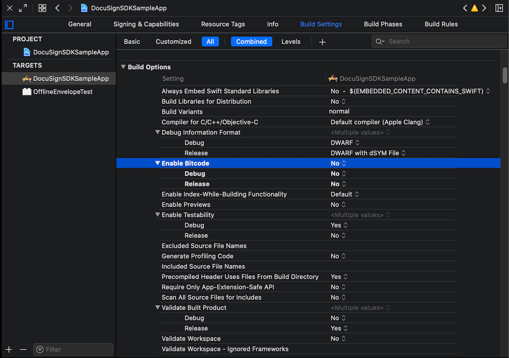
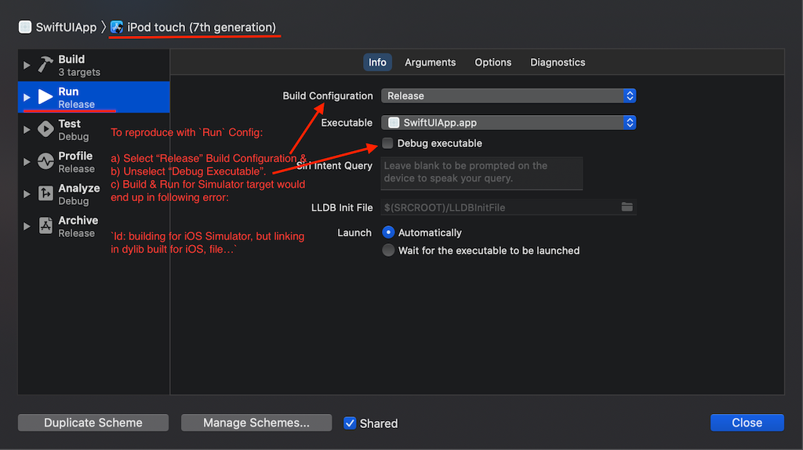
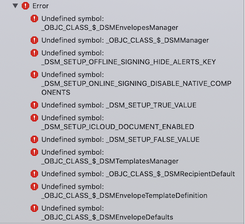
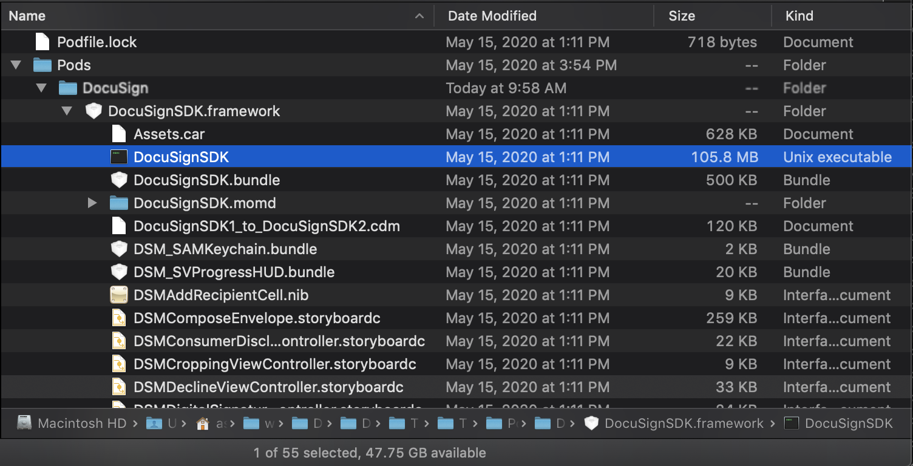

# Troubleshooting DocuSignSDK Integration issues

## 1. Bitcode

### DocuSignSDK does not contain bitcode

```
{
  Apple XCode build error: '/Users/appName.Apps/Pods/DocuSign/DocuSignSDK.framework/DocuSignSDK' does not contain bitcode. You must rebuild it with bitcode enabled (Xcode setting ENABLE_BITCODE), obtain an updated library from the vendor, or disable bitcode for this target. file '/Users/appName.Apps/Pods/DocuSign/DocuSignSDK.framework/DocuSignSDK' for architecture armv7
}
```

Native SDK as of `v2.3.8` does not support bitcode, if your integration is dependent on **Bitcode**, do raise an [issue](https://github.com/docusign/native-ios-sdk/issues). The workaround for now is to have all app targets build without bitcode. In order to disable bitcode, client app would need to set `Enable Bitcode` under `Build Options` to `No` for each of the targets.



## 2. Undefined Symbols

### Simulator Release Build and Run - `Xcode 12.4`

* Swift Compiler Error
  * `ld: building for iOS Simulator, but linking in dylib built for iOS, file '.../Pods/DocuSign/DocuSignSDK.framework/DocuSignSDK' for architecture arm64`

This is a known issue that happens with `SDK v2.5 and earlier` when App Scheme for `Run` has `Release` selected for the Simulator targets. Please raise an [issue](https://github.com/docusign/native-ios-sdk/issues) if this is a blocker.
**Workaround:** Use `Debug` in the `Release Configuration` when building for Simulator.



### Error when building project:

* Undefined symbol:
  * `_OBJC_CLASS_$_DSMEnvelopesManager`, 
  * `_OBJC_CLASS_$_DSMManager`, 
  * `_DSM_SETUP_TRUE_VALUE` and other similar symbols missing



### Root cause:

* Invalid binary file: `DocuSignSDK.framework/DocuSignSDK`
  * In projects with symbol missing issue, `DocuSignSDK` binary file size is in a few KB.
  * `DocuSignSDK` binary file under the framework directory isn't getting fetched correctly via the CocoaPods `pod install`. Correct `DocuSignSDK` binary is over 100MB, for example, the correct binary size as of `v2.2.5` is `105.8MB`. 



### Fix: Ensure Client is fetching DocuSignSDK Binary

1. Close Xcode
2. Go to the solution directory and perform `pod deintegrate` to uninitialize the pods.
3. Remove pods & lock file with `rm Podfile.lock` & `rm -rf Pods/`
4. Clean CocoaPods `DocuSign` pods in cache with `pod cache clean 'DocuSign' --all`
5. Make sure `Podfile` has a correct entry, for example:
  * `pod 'DocuSign'` or
  * Using Specific Commit: `pod 'DocuSign', :git => 'https://github.com/docusign/native-ios-sdk.git', :commit => "3ed4ed6985e44d12c99ae7a9f2b5bda66dd00b4d"`
  * Using Specific Branch: `pod 'DocuSign', :git => 'https://github.com/docusign/native-ios-sdk.git', :branch => "beta-branch-name"`
    * In case you are using specific branch to fetch `DocuSign` pod, **additional steps are required** to install [git-lfs](https://git-lfs.github.com/) as `pod install` fetches binary framework (>100MB file) via git-lfs hooks.
    * Install git-lfs via brew: `brew install git-lfs`
    * Activate git-lfs next: `git lfs install`
6. `pod install` or `pod install --repo-update` 
7. Ensure `DocuSignSDK.framework/DocuSignSDK` binary file is available and is around `~105MB`, If yes, open workspace and build. Report an issue if problem still persists.
