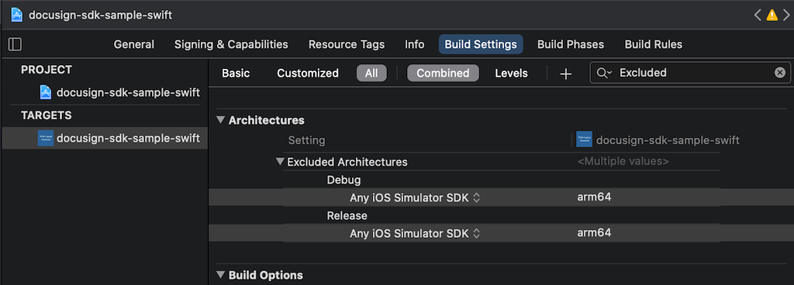

# Troubleshooting DocuSignSDK Integration issues

## 1. Bitcode

### DocuSignSDK does not contain bitcode

```
{
  Apple XCode build error: '/Users/appName.Apps/Pods/DocuSign/DocuSignSDK.framework/DocuSignSDK' does not contain bitcode. You must rebuild it with bitcode enabled (Xcode setting ENABLE_BITCODE), obtain an updated library from the vendor, or disable bitcode for this target. file '/Users/appName.Apps/Pods/DocuSign/DocuSignSDK.framework/DocuSignSDK' for architecture armv7
}
```

Native SDK as of `v2.3.8` does not support bitcode, if your integration is dependent on **Bitcode**, do raise an [issue](https://github.com/docusign/native-ios-sdk/issues). The workaround, for now, is to have all app targets build without bitcode. To disable bitcode, the client app would need to set `Enable Bitcode` under `Build Options` to `No` for every target.


## 2. Simulator Build fails for `arm64`

### Simulator Build error - `Xcode 12`

* `ld: building for iOS Simulator, but linking in dylib built for iOS, file '.../Pods/DocuSign/DocuSignSDK.framework/DocuSignSDK' for architecture arm64`

This is a known issue that happens with Xcode12 based builds for `iphonesimulator*`. For example, this is reproducible by editing App Scheme for `Run` to select `Release` for the Simulator targets. 


With SDK `v2.5`, `pod install` will automatically set `"EXCLUDED_ARCHS[sdk=iphonesimulator*]"` as `YES` to resolve this issue. For earlier builds, follow the next section to resolve it with `Podfile` edit.

### Fix with the `Podfile` 

An app integrating with the DocuSign SDK (before `v2.5` release) could follow this section to resolve the `arm64` error or perform `pod update 'DocuSign'` to get `v2.5` or higher. Any Framework project that's integrated with DocuSignSDK, follow the ["Fix with the `podspec`"](https://github.com/docusign/native-ios-sdk/blob/master/support-files/Integration-Troubleshooting.md#fix-with-the-podspec) below.

First, update the `Podfile` `post_install` section at the end of the Podfile with the following snippet. It would result in excluding `arm64` architecture for all simulator builds.

```
# Add at the end of the `Podfile` to Exclude Architecture `arm64` for simulator builds
post_install do |installer|
  installer.pods_project.build_configurations.each do |config|
    config.build_settings["EXCLUDED_ARCHS[sdk=iphonesimulator*]"] = "arm64"
  end
end
```

Next, after performing `pod install`, open your app **Project's** settings. In `Project` -> `Build Settings` -> Under `Excluded Architectures` add following for `Debug` and `Release` configurations:
- Debug: `Any iOS Simulator SDK` : `arm64`
- Release: `Any iOS Simulator SDK` : `arm64`

Also ensure similar value is set for app **Target's** setting.


### Fix with the `podspec`

Any Framework project integrating with the DocuSign SDK and using `podspec` to distribute the SDK, make the following change in your SDK `podspec` to propagate the `EXCLUDED_ARCHS` settings for `arm64` below to all targets. It's achieved by setting architecture exclusion in `pod_target_xcconfig` & `user_target_scconfig` for `'EXCLUDED_ARCHS[sdk=iphonesimulator*]'` key and using `arm64` as value.

```
  # Propagate the `arm64` in the `EXCLUDED_ARCHS` setting. Replace `spec_name` with correct name.
  spec_name.pod_target_xcconfig = { 'EXCLUDED_ARCHS[sdk=iphonesimulator*]' => 'arm64' }
  spec_name.user_target_xcconfig = { 'EXCLUDED_ARCHS[sdk=iphonesimulator*]' => 'arm64' }
```

Here is some more context around the `podspec` changes for a Swift-based framework using 'DocuSign' pod as a dependency.

```
Pod::Spec.new do |s|
  ... 
  ...
  s.summary =  "iOS Framework Wrapper to integrate with DocuSign pod as dependency"	
  s.swift_version = '5.0'

  # Define the dependency on 'DocuSign' pod
  s.dependency 'DocuSign', '2.5.0'
	
  # Propagate the `arm64` in the `EXCLUDED_ARCHS` setting.
  s.pod_target_xcconfig = { 'EXCLUDED_ARCHS[sdk=iphonesimulator*]' => 'arm64' }
  s.user_target_xcconfig = { 'EXCLUDED_ARCHS[sdk=iphonesimulator*]' => 'arm64' }

  # A sample test_spec
  s.test_spec 'FrameworkWrapperTests' do |test_spec|
    test_spec.source_files = 'FrameworkWrapperTests/Tests/**/*.swift'
    test_spec.resources = 'FrameworkWrapperTests/Resources/**/*.{plist,json,png,bundle}'
    test_spec.test_type = :unit
  end
end
```

Note: Above snippet would need some change if your SDK uses the `xcconfig` in a different way to manage multiple targets.

## 3. Undefined Symbols

### Error when building project:

* Undefined symbol:
  * `_OBJC_CLASS_$_DSMEnvelopesManager`, 
  * `_OBJC_CLASS_$_DSMManager`, 
  * `_DSM_SETUP_TRUE_VALUE` and other similar symbols missing


### Root cause:

* Invalid binary file: `DocuSignSDK.framework/DocuSignSDK`
  * In projects with missing symbol issues, `DocuSignSDK` binary file size is in a few KB.
  * `DocuSignSDK` binary file under the framework directory isn't getting fetched correctly via the CocoaPods `pod install`. Correct `DocuSignSDK` binary is over 100MB. For example, the correct binary size as of `v2.2.5` is `105.8MB`. 


### Fix: Ensure Client is fetching DocuSignSDK Binary

1. Close Xcode
2. Go to the solution directory and perform `pod deintegrate` to uninitialize the pods.
3. Remove pods & lock file with `rm Podfile.lock` & `rm -rf Pods/`
4. Clean CocoaPods `DocuSign` pods in cache with `pod cache clean 'DocuSign' --all`
5. Make sure `Podfile` has a correct entry, for example:
  * `pod 'DocuSign'` or
  * Using Specific Commit: `pod 'DocuSign', :git => 'https://github.com/docusign/native-ios-sdk.git', :commit => "3ed4ed6985e44d12c99ae7a9f2b5bda66dd00b4d"`
  * Using Specific Branch: `pod 'DocuSign', :git => 'https://github.com/docusign/native-ios-sdk.git', :branch => "beta-branch-name"`
    * In case you are using specific branch to fetch `DocuSign` pod, **additional steps are required** to install [git-lfs](https://git-lfs.github.com/) as `pod install` fetches binary framework (>100MB file) via git-lfs hooks.
    * Install git-lfs via brew: `brew install git-lfs`
    * Activate git-lfs next: `git lfs install`
6. `pod install` or `pod install --repo-update` 
7. Ensure `DocuSignSDK.framework/DocuSignSDK` binary file is available and is around `~105MB`, If yes, open workspace and build. Report an issue if problem still persists.
