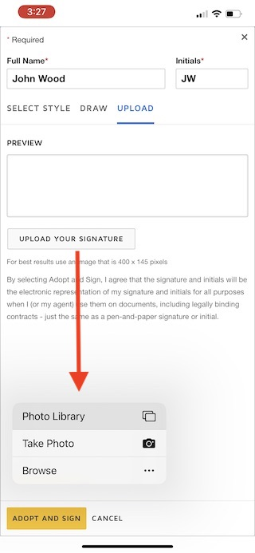

## Usages Permissions Requirements

Native iOS SDK requires access to specific capabilities to prepare the agreement and capture signatures. Depending on the use case, the app can use all or a subset of the usage permissions in the client app.

### Camera Access

Native iOS SDK requires access to the Camera to capture user Signature. If this is the desired feature to use, you may define the usage description in `info.plist` to allow access to the Camera.

`NSCameraUsageDescription` is required in case the app needs to capture a photo for signature adoption.

`Privacy - Camera Usage Description`: `You will be able to use photos taken from your camera to sign a document.`

### Photo Library Access

Like using Camera to capture user signature images, the DocuSign signing experience captures signatures using the Photo Library. The following usage description can be set in `info.plist` access to the Photo Library for your app.

`NSPhotoLibraryUsageDescription` is required in case the app needs to upload images for signature adoption.

`Privacy - Photo Library Usage Description`: `You will be able to use photos taken from your camera to sign a document.`

### Location Access

During the signing process, a signer location information allows DocuSign to display the 'Signed in Location' on a map from within envelope History. By default, DocuSign will include a signer's IP address in the Certificate of Completion as part of the entire audit trail of a document. 

Sample usage description for Contacts access in `info.plist`.

`Privacy - Location When In Use Usage Description`: `DocuSign records the location at which you sign a document to protect your signatures against fraud.`

Additional details on location use can be found [here](https://support.docusign.com/en/articles/Why-does-DocuSign-request-my-location-information-when-signing-a-document).

### Contacts Access

If an app relies on the Apple Contacts to fill signer details, SDK has native-UI-components to fill in contact information (`name` and `email`) using Contacts Access on iOS. Alternative to UI components, the app could use Envelope & Recipient Defaults to set signer information programmatically. Also refer [Envelope Default](../Using-Envelope-Defaults.md) usage guide. 

Sample usage description for Contacts access in `info.plist`.

`Privacy - Contacts Usage Description`: `You will be able to select contacts as recipients to sign a document.`

## Additional Details

### Sample App

### Camera & Photo Library Usage

The Signature Adoption for offline and online signing may benefit from granting Camera & Photo Library access permissions. In the screenshot below, an embedded online signing-based app uses Photo Library or takes pictures using the Camera to capture signatures.

